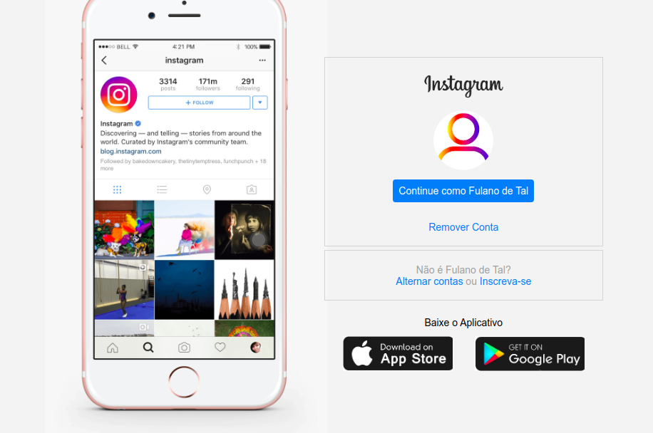
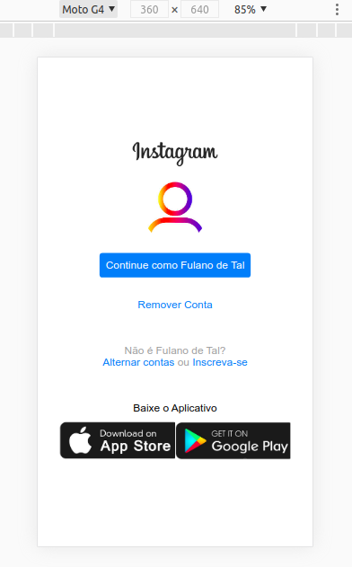

# instaclone-html-css
 Clone da página inicial do Instagram.   
 Projeto desenvolvido durante o **Bootcamp Full Stack Developer** da **Digital Innovation One**, utilizando HTML5 e CSS3 Flexbox.   
 **Você pode acessar o projeto clicando [aqui](https://github.com/igorwc/instaclone-html-css).**
 ***

